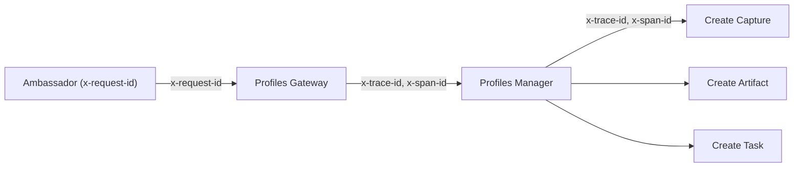
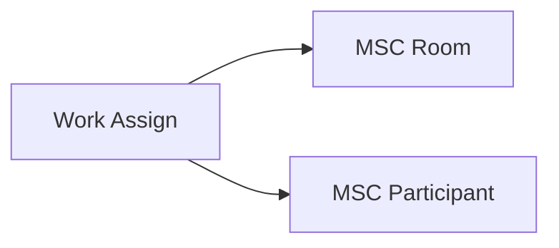
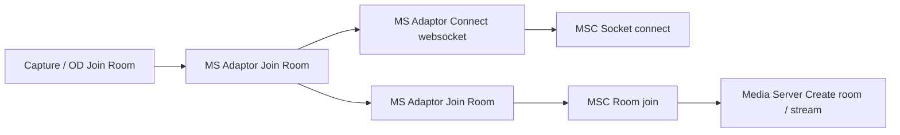
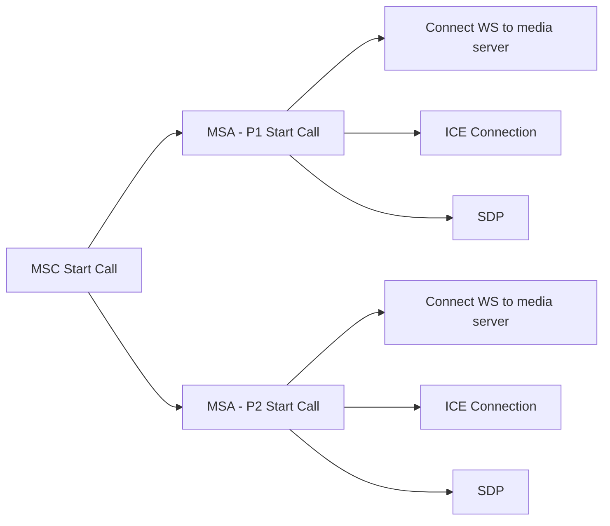
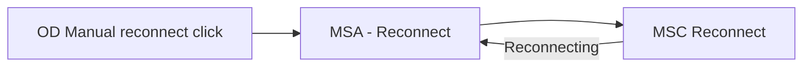
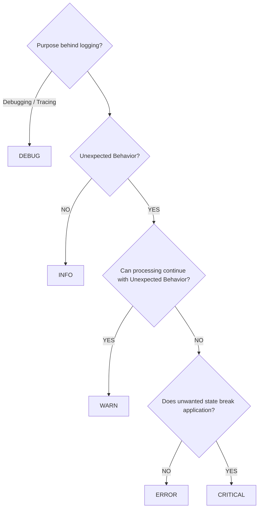

# Understanding Instrumentation - A-Z

To send data to the central data platform, you need to send it in a structured fashion. Most
services use Elixir, Python, Node, or Ruby, and there are libraries in each language you can
use to send data as a stream of the current events happening in your service.

Below is the definition of terms used in these libraries.

## Fields

- **`event_source`**
  - Where the event was generated
- **`service_category`**
  - Set of services working together to provide a functionality
  - Example: `ProfilesGateway`, `Capture`, `AssistedVideo`, `VideoComposition`, etc.
- **`component`**
  - Name of the component inside the service category
  - This can be a separate microservice or a logical component (Module / File) inside a service
  - Example: `AssistedVideo` → (`WorkHandler`, `WorkSupply`, `WorkAssign`), `VideoComposition` →
    (`MJRConversion`, `MJRReattemptConversion`, ...)
- **`service`**
  - Can be thought of as the various functionalities present within the component that, along
    with the `event_type`, create a function that does something
  - Examples
    - `MSController`: `service:Room` `event_type:{Created,Reconnected,Left}`
    - `AssistedVideo`: `service:UserSocket` `event_type:Connected`; `service:WorkQueue`
      `event_type:{Enqueued,Dequeued}`
    - `ProfilesManager`: `service:ProfileState` `event_type:Changed`
- **`event_type`**
  - Check definition of `service`.
  - This is essentially a verb in past tense
  - This represents different actions that are performed in a service
- **`event_value`** (formerly `event_name`)
  - Value that is generated by the event. If no value is generated, this can be the TAT or nil
  - In case of exception, this should be the exception name. Like `IOException`, `HTTPException`,
    etc. This should be enum values in case of exception.
  - Examples
    - `MSController`: `Room:Created` → `room_id`
    - `ProfilesGateway`: `ProfileState:Changed` → `state_value`
- **`details`**
  - This is a JSON that contains any other information for the event that can't fit in any other
    fields.
  - In case of exception, `exception_name` & `exception_description` are mandatory fields which
    can be used for a more detailed view of the exception.
    - `exception_name`: A short version of what went wrong. Unlike `event_value`, this does not
      need to be an enum value & can be more dynamic in nature.
    - `exception_description`: An english sentence or two for a human readable description on
      what went wrong.
- **`timestamp`**
  - Timestamp of the event
- **`ou_id`**
  - OUID associated with the event. Can be null if event does not belong to any OU.
- **`correlation_id`**
  - Unique ID of the highest level of entity within a `service_category` that can be used to
    track & filter all events that belong to that particular entity.
  - Examples
    - `ProfilesGateway` & `ProfilesManager` → `ProfileID`
    - `AssistedVideo` & `SelfVideo` → `TaskID`
    - `MSController` → `RoomID`
  - Like in `ProfilesManager`, `ProfileID` can be used to filter all logs for the profile. We can
    come to know everything that happened for that particular profile in one go.
  - This is different from `trace_id`, which is used to trace a request across multiple services.
    `trace_id` identifies a request (sync flow) / session, while `correlation_id` identifies an
    entity that belongs to the service category.
- **`reference_id`**
  - Value of the primary ID associated with the event
  - Example
    - `ProfilesManager`: `TaskState:Changed` → `TaskID` is the `reference_id` & `ProfileID` is
      the `correlation_id`
- **`reference_type`**
  - Describes what is present in the `reference_id`
  - Example → `"TaskID"`
- **`level`**
  - `INFO`, `WARN`, `ERROR`, `DEBUG`, `CRITICAL`
  - See [Understanding Log Level](#understanding-log-level)
- **`eid`**
  - Unique ID given to each instrumentation event. This is automatically generated by the
    instrumenter library.
- **`app_vsn`**
  - Version of the application that has published the event. This can be generated by the
    library itself (the Elixir instrumenter uses the `mix.exs` version to automatically populate
    this value).
- **`log_version`**
  - This can be useful for rolling out a breaking change in the logs. Multiple parsers can be
    created in logstash for multiple versions of the same log at the same time.
  - Default value is null
- **`span_id`**
  - ID associated with the current span
- **`parent_span_id`**
  - ID of the parent span
- **`trace_id`**
  - ID of the individual traces

## Distributed Tracing

`trace_id`, `span_id` & `parent_span_id` can be used to create a tree structure for an
**operation**.

Operation can be defined as a sync flow. Something cannot be part of the same trace if there is
an uncertain time gap between two spans. Example is a worker or an unbound manual action (or all
manual actions), which will always start a new trace.

An example of a somewhat larger trace is `AssistedVideo` allocation. When the allocation
happens, room & participants are created on MSC, an event is sent to OH which then sends the
allocation request to OD, where an agent has max 10 sec to perform an action on this. After the
agent accepts the call, a "connect to video session" event is sent to both Capture & OD, where
they independently try to establish a connection to MSC. In the second person's join-room
request, media server room creation will also happen, which will send the start event to the
frontend, and they independently connect to the media servers. This entire operation can be
treated like a sync operation & can fall under the same trace. This way, if the media server
room creation fails, we can traverse to the root of this trace to identify the allocation &
everything along the way that this exception is going to impact.

### Why distributed tracing

- Figure out where time is spent for slow operations
- Trace the entire request for touch points across all services
- Figure out the impact of exceptions

### Implementation

- Add another log level `TRACE`. By default we will only send trace events to stdout & not the
  event bus. Only info events will be sent to the event bus.
- **Context extraction**: `trace_id`, `span_id` & `parent_span_id` will be collected by the
  instrumenter library. How these are generated & collected can be optimised by exposing macros
  that generate & attach these IDs in process memory.
- **Context parser**: We need separate helper functions in the instrumenter library to extract
  trace & span ids from http, rabbitmq & socket headers, so that these headers can be
  standardised throughout the platform.
- The IDs will be part of both instrumentation & trace events. That means **all instrumentation
  events are trace events as well, but not all trace events are instrumentation events**. (What
  if we want to instrument events that do not belong to a span?)
- These IDs will not be published to the event bus but will be published to stdout. We can use
  stackdriver to search for traces using these IDs across services.
- Additionally, we can integrate with a distributed tracing solution like jaegertracing / zipkin
  / google cloud trace (via the instrumenter library). This can help us provide better
  visibility across the platform. (Still need to figure out the best possible solution available
  & the implementation details — shovel-like implementation or not.)
- Reason for not integrating the solutions' client libraries directly into the individual
  services is that doing so will make us permanently attached to a particular solution, and
  switching between them & experimenting with multiple won't be possible, as the change will
  require a code change in all the services.

### Additional Fields (Draft)

- `trace_name` (optional)
- `span_name` (sc + component + service can be used)
- `span_start_timestamp` (calculated internally in the instrumenter)

### Code samples

```elixir
span_ctx = Instrumenter.Tracer.extract(:http_headers, req_headers)

span = Instrumenter.start_span(%{
  "ou_id" => "",
  "correlation_id" => "",
  "reference_id" => "",
  "reference_type" => "",
  "service" => ""
}, ctx: span_ctx) # If no ctx is provided, a new trace is generated

# Invoked log can be logged along with the start_span function
# or in a separate function after create span

# Only stdout & trace collector
Instrumenter.trace(%{
  "event_type" => "",
  "event_value" => "",
  "details" => %{}
}, span: span)

# trace + instrumentation
Instrumenter.info(%{
  "event_type" => "",
  "event_value" => "",
  "details" => %{}
}, span: span)

# trace + instrumentation
Instrumenter.error(%{
  "event_value" => "",
  "details" => %{
    "exception_name" => "",
    "exception_description" => ""
  }
}, span: span)

# Structured log without span (event)
Instrumenter.trace(%{
  "ou_id" => "",
  "correlation_id" => "",
  "reference_id" => "",
  "reference_type" => "",
  "service" => "",
  "event_type" => "",
  "event_value" => "",
  "details" => %{}
})

# Structured log + instrumentation without span (event)
Instrumenter.info(%{
  "ou_id" => "",
  "correlation_id" => "",
  "reference_id" => "",
  "reference_type" => "",
  "service" => "",
  "event_type" => "",
  "event_value" => "",
  "details" => %{}
})
```

#### Passing span to functions

```elixir
span_ctx = Instrumenter.Tracer.extract(:http_headers, req_headers)

span = Instrumenter.start_span(%{
  "ou_id" => "",
  "correlation_id" => "",
  "reference_id" => "",
  "reference_type" => "",
  "service" => "",
}, ctx: span_ctx)

my_func(a, span_ctx: Instrumenter.Trace.get_context(span))

def my_func(a, opts \\ []) do
  span = Instrumenter.start_span(%{
    "ou_id" => "",
    "correlation_id" => "",
    "reference_id" => "",
    "reference_type" => "",
    "service" => "",
  }, ctx: opts[:span_ctx])

  # Do something

  Instrumenter.trace(%{
    "event_type" => "",
    "event_value" => "",
    "details" => %{}
  }, span: span)
end
```

Another option is to use the OpenTelemetry client library for tracing & passing the span context
to the instrumenter library, so that logs & traces can be linked. This feature is available in
stackdriver logging & tracing.

- Integrating Tracing and Logging with OpenTelemetry and Stackdriver *(external link)*
- Integrating Traces and Logs with OpenTelemetry *(external link)*

## DT Tree examples

Example traces, showing how `x-request-id` / `x-trace-id` / `x-span-id` propagate to build a
trace tree.











> **Note:** the doc from here on only contains links & text from external sources.

## OpenTelemetry collector

- Collector *(external link)*

## OpenTracing Specifications

link: OpenTracing specification *(external link)*

**Traces** in OpenTracing are defined implicitly by their **Spans**. In particular, a **Trace**
can be thought of as a directed acyclic graph (DAG) of **Spans**, where the edges between
**Spans** are called **References**.

Each **Span** encapsulates the following state:

- An operation name
- A start timestamp
- A finish timestamp
- A set of zero or more key:value **Span Tags**. The keys must be strings. The values may be
  strings, bools, or numeric types.
- A set of zero or more **Span Logs**, each of which is itself a key:value map paired with a
  timestamp. The keys must be strings, though the values may be of any type. Not all OpenTracing
  implementations must support every value type.
- A **SpanContext** (see below)
- References to zero or more causally-related **Spans** (via the **SpanContext** of those related
  **Spans**)

Each **SpanContext** encapsulates the following state:

- Any OpenTracing-implementation-dependent state (for example, trace and span ids) needed to
  refer to a distinct **Span** across a process boundary
- **Baggage Items**, which are just key:value pairs that cross process boundaries

## Understanding Log Level

A decision tree for choosing the right log level:



| Level | When to use |
|-------|-------------|
| `DEBUG` | Logging for debugging / tracing |
| `INFO` | Normal behavior, no unexpected state |
| `WARN` | Unexpected behavior, but processing can continue |
| `ERROR` | Unexpected behavior that stops processing, but does not break the application |
| `CRITICAL` | Unwanted state that breaks the application |
